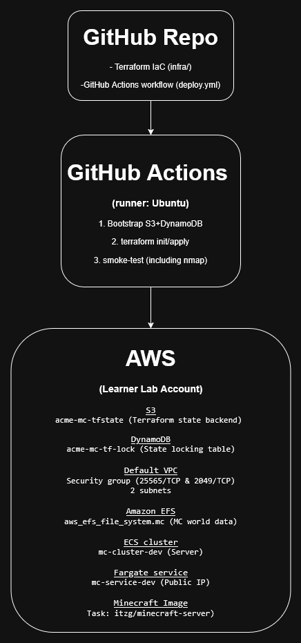

# minecraft-project

## Requirements

| Tool                            | Version tested       | Notes                                                                                 |
| ------------------------------- | -------------------- | ------------------------------------------------------------------------------------- |
| **Terraform**                   |  ≥ 1.8.0             | Required to run locally                                                               |
| **AWS CLI v2**                  |  ≥ 2.15              | Required to run locally                                                               |
| **Git**                         |  2.49.0              | Required to locally clone / commit                                                    |
| **GitHub account**              |                      | GH Actions used to run whole pipeline on push                                         |
|                                 |                      |           ****                                                                        |
| **Learner Lab AWS credentials** |                      |                                                                                       |
| `AWS_ACCESS_KEY_ID`             |                      |                                                                                       |
| `AWS_SECRET_ACCESS_KEY`         |                      |                                                                                       |
| `AWS_SESSION_TOKEN`             |                      |                                                                                       |
| `AWS_REGION` (e.g. `us-east-1`) |                      |                                                                                       |

---

## Pipeline Overview
| Stage                         | What happens                                                                          | File(s)                        |
| ----------------------------- | ------------------------------------------------------------------------------------- | ------------------------------ |
| **0. GitHub Secrets**         | Add the four Learner‑Lab variables to Repository secrets                          |                                |
| **1. Run Workflow**           | Begins Deployment                                                                     | `.github/workflows/deploy.yml` |
| **2. AWS CLI auth**           | `aws-actions/configure-aws-credentials@v3` exports the secrets as CLI creds           |                                |
| **3. Backend bootstrap**      | Bash step creates S3 bucket** + DynamoDB lock table if they don’t exist         |                                |
| **4. Terraform init / apply** | `infra/` code provisions                cluster/service                               |  `infra/*.tf`                  |
| **5. Smoke test**             | Ensure proper setup ie `nmap -sV -Pn -p 25565`                                        | workflow                       |

Successful run prints:

```
PORT      STATE SERVICE VERSION
25565/tcp open  minecraft 1.21.5
```

---

## Pipeline diagram



## Local Usage Guide

This project is designed to be deployed using GitHub actions. It should be possible to simply fork the repository using a GitHub student account, add the necessary repository secrets,
and run the workflow under the actions tab. Locally, it's possible to do something similiar.

1. **Clone the repo**

   ```bash
   git clone https://github.com/your‑org/minecraft‑aws.git
   cd minecraft‑aws
   ```
2. **Get Learner‑Lab credentials from learner lab page**:

   ```bash
   AWS_ACCESS_KEY_ID=…
   AWS_SECRET_ACCESS_KEY=…
   AWS_SESSION_TOKEN=…
   AWS_REGION=us-east-1
   ```
3. **Initialize Terraform** (first run also creates the remote backend):

   ```bash
   cd infra
   terraform init
   ```
4. **Plan & apply**

   ```bash
   terraform plan
   terraform apply
   ```
5. **Find the server IP** = script prints it:

6. **Connect in Minecraft** → *Add Server* → address `PUBLIC_IP:25565`.
   
> **Windows users:** If attempting to run locally, use WSL 2 or install the Windows Terraform & AWS CLI binaries and run the commands in PowerShell.
---

## Clean‑up

From your workstation or via Actions *workflow\_dispatch* parameter:

```bash
cd infra
terraform destroy -auto-approve
```

This tears down the ECS service/cluster, EFS, security group, and leaves the
S3 bucket + DynamoDB table so future deploys keep the same remote state.
To remove the backend as well, delete the two resources manually or with the
AWS CLI.

---

## Resources / Sources

* **Terraform AWS Provider Docs** – [https://registry.terraform.io/providers/hashicorp/aws/latest/docs](https://registry.terraform.io/providers/hashicorp/aws/latest/docs)
* **Terraform S3 Backend** – [https://developer.hashicorp.com/terraform/language/settings/backends/s3](https://developer.hashicorp.com/terraform/language/settings/backends/s3)
* **terraform‑aws‑modules/s3‑bucket** (used during early prototyping) – [https://github.com/terraform-aws-modules/terraform-aws-s3-bucket](https://github.com/terraform-aws-modules/terraform-aws-s3-bucket)
* **Itzg Minecraft Server image** – [https://hub.docker.com/r/itzg/minecraft-server](https://hub.docker.com/r/itzg/minecraft-server)
